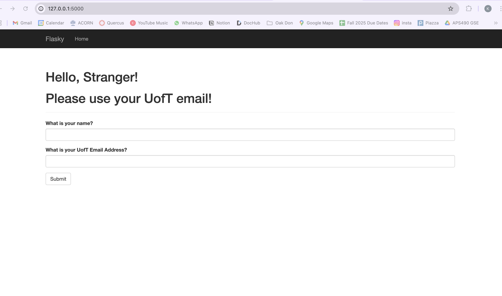
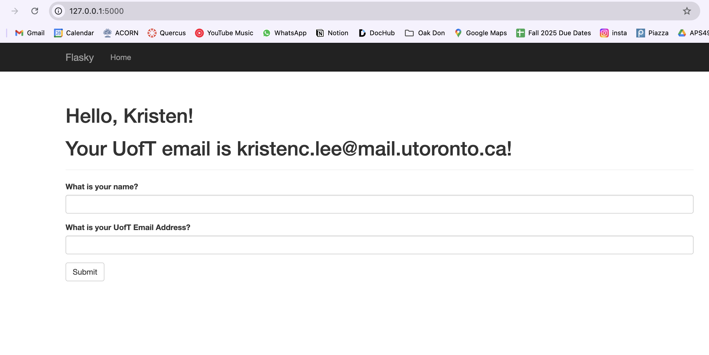
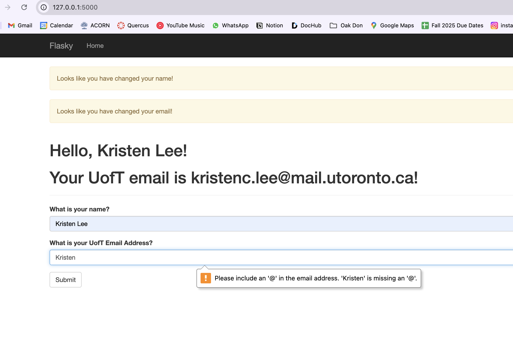
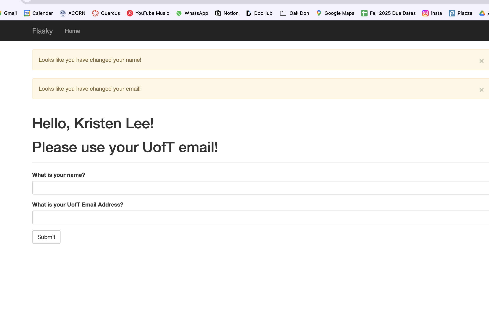
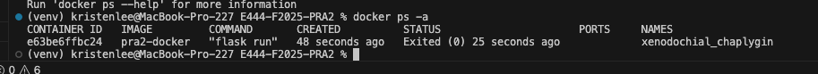

# ECE444 Lab 2 - Flask & Docker

After this recitation, the students should be able to:
1.Install Flask and implement an interactive HelloWorld example, and understand
the basics of how flask works, templates, web forms and connecting to
Databases.
2.Download and install Docker.
3.Pull and run the updated version of the Flask Activity on their localhost.
4.Build and run docker images of the Flask Activity on their localhost.

This repo is a clone of https://github.com/miguelgrinberg/flasky

## Activity 1.4

Starting page

Logged In

Error

Non-UofT Email

Docker

